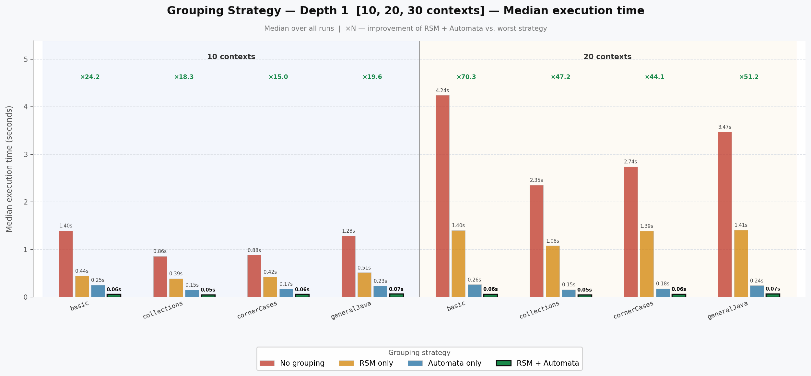
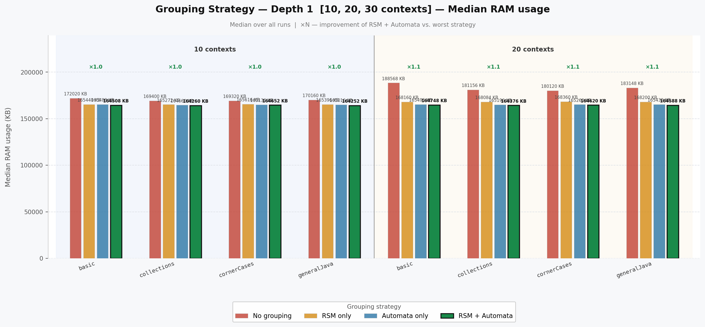
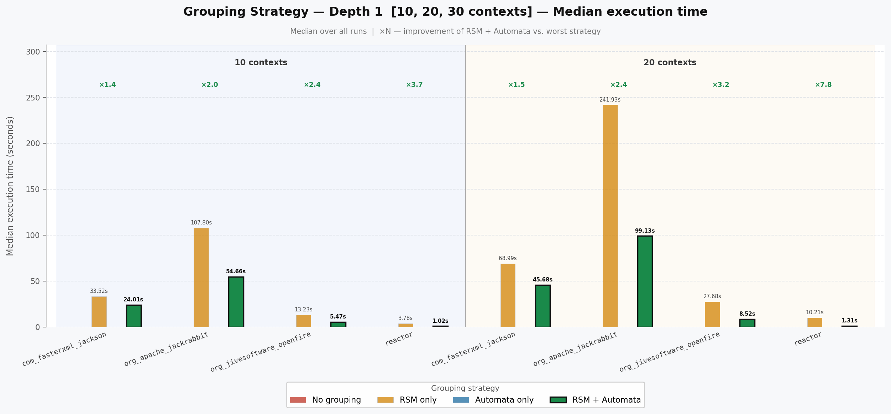
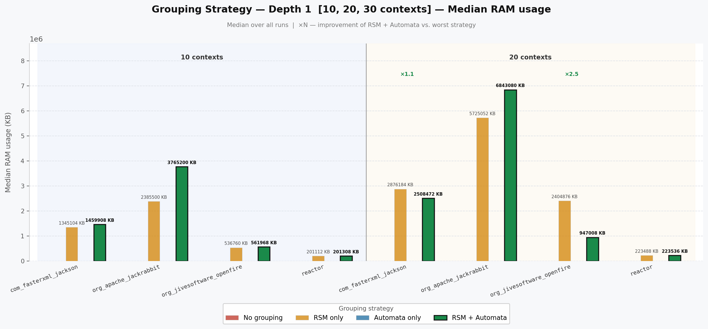
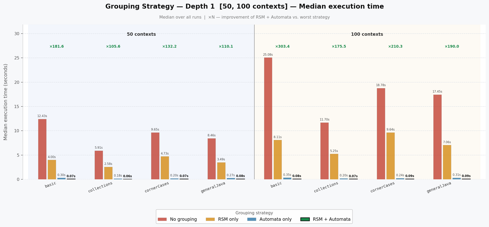
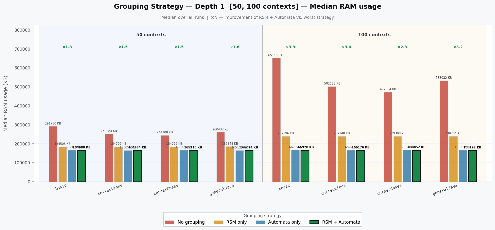
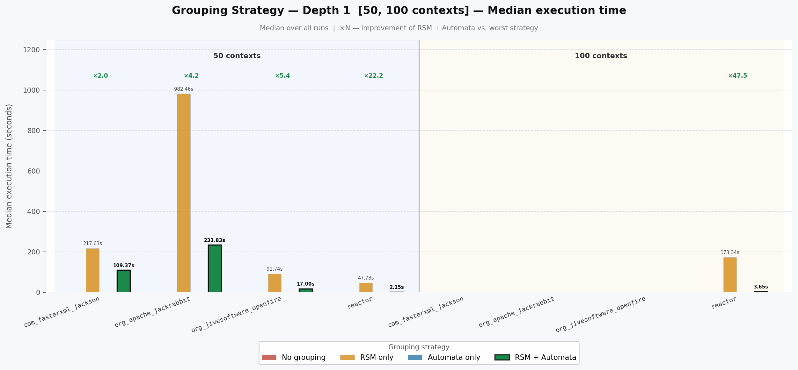
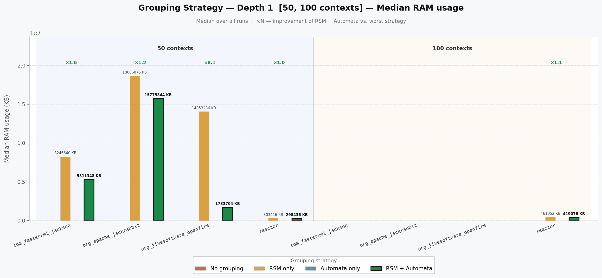
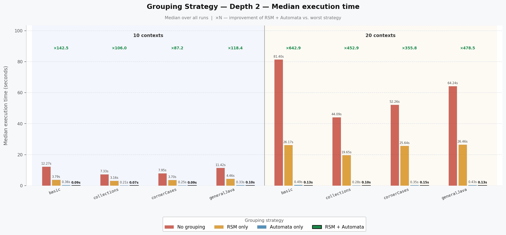
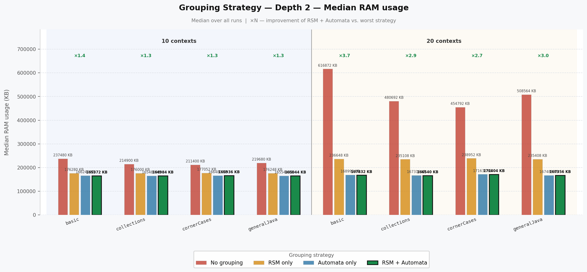

# Benchmark: Influence of Grouping on Performance

This project evaluates the impact of grouping strategies (RSM and Automata) on execution time and RAM usage when finding pairs of reachable nodes with Interlyved Dick Language constraint.

## Experiment Description

### Parameters

- **Depth**: Context depth (1 or 2)
- **Number of contexts**: 10, 20, 30 (small) or 50, 100 (large)

- **Graphs**:
  - **Small**: `collections`, `cornerCases`, `generalJava`, `basic`
  - **Large**: `com_fasterxml_jackson`, `org_apache_jackrabbit`, `org_jivesoftware_openfire`, `reactor`

### Graph Datasets info

| Graph                    | Vertices | Edges  |
|--------------------------|----------|--------|
| basic                    | 230      | 274    |
| collections              | 165      | 175    |
| cornerCases              | 245      | 295    |
| generalJava              | 155      | 186    |
| reactor                  | 26997    | 45309  |
| com_fasterxml_jackson    | 243764   | 586934 |
| org_jivesoftware_openfire| 298553   | 551124 |
| org_apache_jackrabbit    | 362179   | 953587 |

### Grouping Strategies

- No grouping
- RSM only
- Automata only
- RSM + Automata

### Measured Metrics

- **Execution time** (seconds)
- **RAM usage** (KB)

## Results Summary

### Small Graphs — Number of pairs of reachable nodes by Context Count and Depth

#### Depth 1

| Graph       | 10 ctx | 20 ctx | 50 ctx | 100 ctx |
|-------------|--------|--------|--------|---------|
| basic       | 114    | 114    | 114    | 114     |
| cornerCases | 149    | 149    | 149    | 149     |
| generalJava | 86     | 86     | 86     | 86      |
| collections | 63     | 63     | 63     | 63      |

#### Depth 2

| Graph       | 10 ctx | 20 ctx |
|-------------|--------|--------|
| basic       | 80     | 80     |
| cornerCases | 96     | 96     |
| generalJava | 60     | 60     |
| collections | 48     | 48     |

Deeper context analysis produces more compact representations.

### Large Graphs — Number of pairs of reachable nodes (Depth 1)

| Graph                    | 1 ctx  | 10 ctx | 20 ctx | 50 ctx |
|--------------------------|--------|--------|--------|--------|
| reactor                  | 12872  | 11877  | 11826  | 11763  |
| org_jivesoftware_openfire| 44859  | 43033  | 42954  | 42900  |
| com_fasterxml_jackson    | 639943 | 585832 | 584979 | 583947 |
| org_apache_jackrabbit    | 1183149| 1058934| 1048125| 1048904|

Increasing the number of contexts reduces the number of pairs of reachable nodes.

> **Note:** For large graphs with >400 fields, only RSM-enabled configurations (`f t`, `t t`) were tested. Configurations without RSM (`f f`, `t f`) were skipped because field grouping was enabled by default to avoid excessive slowdown. This is work for future anaylises.

### Depth 1 — Small Graphs (10 contexts)

### Depth 1 — Large Graphs (10 contexts)

### Depth 1 — Small Graphs (50 contexts)

### Depth 1 — Large Graphs (50 contexts)

### Depth 2 — Small Graphs (all contexts)

## Key Findings

1. **RSM + Automata** provides the best performance in most cases (marked in green)
2. The speedup ratio (×N) shows improvement compared to the worst strategy
3. Larger contexts (50, 100) generally show more significant benefits from grouping
4. RAM usage follows similar patterns to execution time
5. For large graphs with >400 fields, field grouping was enabled by default — configurations without RSM (`f f`, `t f`) were skipped to avoid excessive slowdown. This is work for future anaylises.